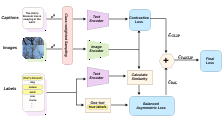

# TailCLIP

## Introduction
This repository contains the code required to reproduce the results in our paper **TailCLIP: Long-Tailed Multi-Label Image Classification through Balanced Representation Learning**.

### Abstract
The advancement of computer vision has emphasized the importance of multi-label classification, particularly in long-tailed scenarios. This task is crucial for real-world applications, where biased data often reduces accuracy for rare classes. Previous models compromise performance on either the head or the tail or depend on handmade natural language image captions. Our model addresses all of these shortcomings. We introduce a novel loss function that serves as a unified framework. Our approach combines contrastive loss, which focuses on distancing negative examples from the decision boundary (suited for long-tailed scenarios), with our novel Balanced Asymmetric Loss, which emphasizes positive examples near the decision boundary. We leverage textual and visual features pre-trained on millions of image-text pairs as a base model. Furthermore, we incorporate unbalanced sampling based on class occurrence to ensure effective training of rare classes. By integrating these two losses, we successfully perform long-tailed multi-label classification without compromising performance on any class. Experiments conducted on standard multi-label recognition benchmarks under VOC-MLT and COCO-MLT datasets demonstrate our approach's advantage, achieving +4.38% and +4.88% improvements in mAP over state-of-the-art methods. Our code will be publicly available.

Authors are Christoph Timmermann, Seunghyeon Jung, Miso Kim and Woojin Lee.


## Python requirements
We tested this code with Python 3.12.3, PyTorch 2.3.1, and CUDA 11.8.

A conda environment `tailclip` with all needed packages can be created by running
```console
conda create --name tailclip --file requirements-conda.txt
```

Alternatively, pip can be used to install the packages by running
```console
pip install -r requirements.txt
```

## Downloading datasets
The dataset splits, captions, and labels are included in this repository. However, the images need to be downloaded separately.

### VOC-MLT

To use VOC-MLT, run the following commands (on Linux):
```console
chmod +x datasets/voc_mlt/download_voc_mlt.sh
datasets/voc_mlt/download_voc_mlt.sh
```
This will download the required images.

### COCO-MLT

To use COCO-MLT, run the following commands (on Linux):
```console
chmod +x datasets/coco_mlt/download_coco_mlt.sh
datasets/coco_mlt/download_coco_mlt.sh
```
This will download the required images.

## Running

To train TailCLIP, run `train.py` with a `config` argument pointing to a config .py file.
We included our hyperparameter configs for VOC-MLT and COCO-MLT with ViT-B/16 and RN-50 image encoder backbones.

```console
python train.py --config=configs/config_voc_mlt_rn50.py
python train.py --config=configs/config_voc_mlt_vitb16.py
python train.py --config=configs/config_coco_mlt_rn50.py
python train.py --config=configs/config_coco_mlt_vitb16.py
```
