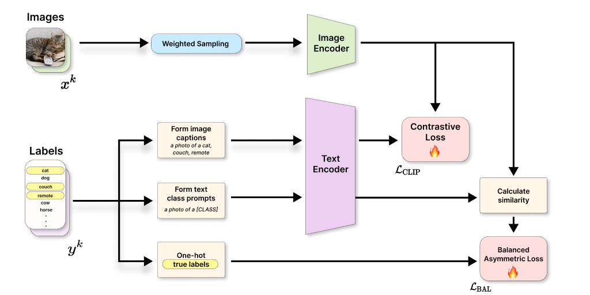

# LM-CLIP [](https://doi.org/10.1109/ACCESS.2025.3561581) [](https://www.python.org/downloads/release/python-3123/) [](https://pytorch.org/get-started/previous-versions/) [![CC BY 4.0][cc-by-shield]][cc-by]

## Introduction
This repository contains the code required to reproduce the results in our paper **LM-CLIP: Adapting Positive Asymmetric Loss for Long-Tailed Multi-Label Classification**.

### Abstract
Accurate multi-label image classification is essential for real-world applications, especially in scenarios with long-tailed class distributions, where some classes appear frequently while others are rare. This imbalance often leads to biased models that struggle to accurately recognize underrepresented classes. Existing methods either trade off performance between head and tail classes or rely on image captions, limiting adaptability. To address these limitations, we propose LM-CLIP, a novel framework built around a unified loss function. Our Balanced Asymmetric Loss (BAL) extends traditional asymmetric loss by emphasizing the gradients of rare positive samples where the model is uncertain, mitigating bias toward dominant classes. This is complemented by a contrastive loss that pushes negative samples further from the decision boundary, creating a more optimal embedding space even in long-tailed scenarios. These loss functions together ensure balanced performance across all classes. Our framework is built on pre-trained models utilizing textual and visual features from millions of image-text pairs. Furthermore, we incorporate a dynamic sampling strategy that prioritizes rare classes based on their occurrence, which ensures effective training without compromising overall performance. Experiments conducted on VOC- MLT and COCO-MLT benchmarks demonstrate the effectiveness of our approach, achieving +4.66% and +8.14% improvements in mean Average Precision (mAP) over state-of-the-art methods.

Authors are Christoph Timmermann, Seunghyeon Jung, Miso Kim and Woojin Lee.


## Python environment
We tested this code with Python 3.12.3, PyTorch 2.3.1, and CUDA 11.8.

A conda environment `lm-clip` with all needed packages can be created by running
```console
conda env create -f environment.yml
```

## Downloading datasets
The dataset splits and labels are included in this repository. However, the images need to be downloaded separately.

### VOC-MLT

To use VOC-MLT, run the following commands (on Linux):
```console
cd dataset_loaders/voc_mlt
chmod +x ./download_voc_mlt.sh
./download_voc_mlt.sh
cd ../..
```
This will download the required images.

### COCO-MLT

To use COCO-MLT, run the following commands (on Linux):
```console
cd dataset_loaders/coco_mlt
chmod +x ./download_coco_mlt.sh
./download_coco_mlt.sh
cd ../..
```
This will download the required images.

## Running

### Training
To train LM-CLIP, run `train.py` with a `--config` argument pointing to a config .py file.
We included our hyperparameter configs for VOC-MLT and COCO-MLT with RN-50, ViT-B/16, and ViT-L/14 image encoder backbones.

```console
python train.py --config=configs/voc_mlt_rn50.py
python train.py --config=configs/voc_mlt_vitb16.py
python train.py --config=configs/voc_mlt_vitl14.py

python train.py --config=configs/coco_mlt_rn50.py
python train.py --config=configs/coco_mlt_vitb16.py
python train.py --config=configs/coco_mlt_vitl14.py
```
TensorBoard events and model checkpoints will be saved to `runs/`.
Checkpoints `best_valid_mAP.pt` and `best_valid_mAP_tail.pt` will be saved by default.

### Testing
To evaluate a trained model, run `test.py` with a `--config` argument pointing to a config.py file.
By default, `best_valid_mAP.pt` will be loaded. This can be changed with the `--checkpoint` argument.
To only load pre-trained CLIP, use `--zeroshot=True`.

```console
python test.py --config=configs/voc_mlt_rn50.py
python test.py --config=configs/voc_mlt_vitb16.py
python test.py --config=configs/voc_mlt_vitl14.py
python test.py --config=configs/coco_mlt_rn50.py
python test.py --config=configs/coco_mlt_vitb16.py
python test.py --config=configs/coco_mlt_vitl14.py

python test.py --config=configs/voc_mlt_rn50.py --checkpoint=best_valid_mAP_tail.pt
python test.py --config=configs/voc_mlt_vitb16.py --checkpoint=best_valid_mAP_tail.pt
python test.py --config=configs/voc_mlt_vitl14.py --checkpoint=best_valid_mAP_tail.pt
python test.py --config=configs/coco_mlt_rn50.py --checkpoint=best_valid_mAP_tail.pt
python test.py --config=configs/coco_mlt_vitb16.py --checkpoint=best_valid_mAP_tail.pt
python test.py --config=configs/coco_mlt_vitl14.py --checkpoint=best_valid_mAP_tail.pt

python test.py --config=configs/voc_mlt_rn50.py --zeroshot=True
python test.py --config=configs/voc_mlt_vitb16.py --zeroshot=True
python test.py --config=configs/voc_mlt_vitl14.py --zeroshot=True
python test.py --config=configs/coco_mlt_rn50.py --zeroshot=True
python test.py --config=configs/coco_mlt_vitb16.py --zeroshot=True
python test.py --config=configs/coco_mlt_vitl14.py --zeroshot=True
```

## BibTeX Citation
Please cite LM-CLIP if it helps your research:
```bibtex
@ARTICLE{timmermann2025lm,
  author={Timmermann, Christoph and Jung, Seunghyeon and Kim, Miso and Lee, Woojin},
  journal={IEEE Access}, 
  title={LM-CLIP: Adapting Positive Asymmetric Loss for Long-Tailed Multi-Label Classification}, 
  year={2025},
  volume={13},
  number={},
  pages={71053-71065},
  keywords={Heavily-tailed distribution;Head;Tail;Multi label classification;Training;Visualization;Adaptation models;Focusing;Tuning;Optimization;Long-tailed learning;multi-label classification;CLIP;vision-language models;contrastive learning;class imbalance;loss functions;asymmetric loss;balanced asymmetric loss;imbalanced sampling},
  doi={10.1109/ACCESS.2025.3561581}
}
```

## Acknowledgements

We use code from [CLIP](https://github.com/openai/CLIP), [OpenCLIP](https://github.com/mlfoundations/open_clip), [ASL](https://github.com/Alibaba-MIIL/ASL), and [LMPT](https://github.com/richard-peng-xia/LMPT). We thank the authors for releasing their code.

## License

This work is licensed under a
[Creative Commons Attribution 4.0 International License][cc-by].

[cc-by]: http://creativecommons.org/licenses/by/4.0/
[cc-by-image]: https://i.creativecommons.org/l/by/4.0/88x31.png
[cc-by-shield]: https://img.shields.io/badge/license-CC%20BY%204.0-lightgrey.svg
